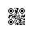

# Simple QR Generator

Simple QR Generator is a lightweight TypeScript toolkit for producing highly-customizable QR codes as SVG strings. It wraps the battle-tested `qrcodegen` algorithm with a fluent builder API, rich content helpers (WiFi, SMS, email, phone, URLs, free text), and advanced styling controls for finder patterns and data modules.

## Features
- Fluent `QRBuilder` guides you through setting the content type, providing structured config data, tuning rendering options, and exporting an SVG payload in one chainable flow.[^1]
- Built-in content formatters escape user data safely and normalize common QR payloads including WiFi credentials, phone numbers, SMS messages, emails, URLs, and plain text.[^2]
- Fine-grained styling: switch finder borders, finder centers, and data modules between circular, square, rounded, squircle, triangle, diamond, bagel, and corner-flow variants to match your brand.[^3]
- Sensible defaults for margins, colors, module scale, and error correction levels with the ability to override everything when needed.[^1]
- Generates standards-compliant matrices via the upstream `qrcodegen` reference implementation to ensure excellent readability across scanners.[^4]
- Ships with Vitest-powered unit tests and coverage tooling for confident integrations.

## Installation

```bash
npm install @skyordi/simple-qr-gen
```

The package ships pre-compiled CommonJS in `dist/` and TypeScript sources for editor tooling.

## Quick Start

```ts
import {
  QRBuilder,
  QRContentType,
  SegmentStrategyType,
  Ecc,
} from '@skyordi/simple-qr-gen';

const svg = new QRBuilder()
  .setQRType(QRContentType.WIFI)
  .setQRConfig({
    ssid: 'My Network',
    password: 'super-secret',
  })
  .setQrOptions({
    foregroundColor: '#0f172a',
    backgroundColor: '#f8fafc',
    margin: 8,
    moduleScale: 1.25,
    ErrorCorrection: Ecc.HIGH,
    FinderBorderSegments: SegmentStrategyType.SquircleBorder,
    FinderInsideSegments: SegmentStrategyType.SquircleInside,
    DataSegments: SegmentStrategyType.RoundedSquare,
  })
  .buildQRSVG();

console.log(svg); // => <svg ...>...</svg>
```

## API Overview

### `QRBuilder`

| Step | Description |
| ---- | ----------- |
| `setQRType(type)` | Select the logical content type (WiFi, phone, SMS, email, URL, text). |
| `setQRConfig(config)` | Provide the strongly-typed payload for the chosen content type. |
| `setQrOptions(options)` | Adjust rendering options (colors, margins, module scale, error correction, segment strategies). |
| `buildQRSVG()` | Validates prerequisites, formats the payload, encodes the QR matrix, and returns an SVG string. |

`QRBuilder` enforces that type, config, and options are present before building, reducing runtime mistakes.[^1]

### Content Helpers

Supported content enums and config interfaces:

| Type | Config |
| ---- | ------ |
| `QRContentType.WIFI` | `WiFiConfig` (`ssid`, optional `password`, `encryption`, `hidden`) |
| `QRContentType.PHONE` | `PhoneConfig` (`phoneNumber`) |
| `QRContentType.SMS` | `SMSConfig` (`phoneNumber`, optional `message`) |
| `QRContentType.EMAIL` | `EmailConfig` (`email`, optional `subject`, `body`) |
| `QRContentType.URL` | `URLConfig` (`url`) |
| `QRContentType.TEXT` | `TextConfig` (`text`) |

Each formatter escapes or normalizes input to match QR payload conventions—for example, WiFi credentials escape reserved characters, phone numbers strip non-dialable characters, and URLs gain a default scheme if missing.[^2]

### Styling Options

`QrSvgOptions` lets you influence the renderer without digging into SVG primitives:[^5]

| Option | Purpose |
| ------ | ------- |
| `margin` | Quiet zone padding around the code (default `4`). |
| `foregroundColor` | Color of modules (default `#000000`). |
| `backgroundColor` | Canvas color (default `#fff`). |
| `moduleScale` | Radius/size multiplier for modules (default `1`). |
| `ErrorCorrection` | One of `Ecc.LOW`, `MEDIUM`, `QUARTILE`, `HIGH`. |
| `FinderInsideSegments` | Strategy for the finder center (`Circular`, `Square`, `Diamond`, `RoundedSquare`, `CircularInside`, `CornerflowInside`, `SquircleInside`). |
| `FinderBorderSegments` | Strategy for finder rings (`Circular`, `Square`, `BagelBorder`, `RoundedSquare`, `SquircleBorder`, `CornerflowBorder`). |
| `DataSegments` | Strategy for data modules (`Circular`, `Square`, `Triangle`, `RoundedSquare`, `Diamond`). |

Segment strategies are implemented via a factory that produces circles, rounded squares, squircles, triangles, diamonds, rings, and corner-flow glyphs on demand.[^3]

### SVG Output

`SVGBuildHelper` composes the final markup by registering segment buckets, accumulating shapes, and emitting `<rect>`, `<circle>`, `<polygon>`, or `<path>` elements with optional `fill-rule` / `clip-rule` attributes.[^6] The result is a standalone `<svg>` string ready to inline in HTML, convert to raster imagery, or pipe into downstream tooling.

## QR Gallery

- 
- 
- 

Each sample was generated with `QRBuilder` by swapping segment strategies, colors, and margins to highlight the styling surface area.

## Extending Segment Strategies

`SegmentCreatorFactory` is the central registry that maps a `SegmentStrategyType` enum to a concrete `ISegmentCreateStrategy` implementation.[^3] Add your own glyphs in three steps:

1. **Create a new enum entry** in `SegmentStrategyType` (and update the `FinderInsideSegments`, `FinderBorderSegments`, or `DataSupportedSegments` unions if it applies).[^5]
2. **Implement a strategy** that draws your shape with `SVGBuildHelper`. You can mix primitives (`AddRectInSegment`, `AddCircleInSegment`, `AddPathInSegment`, etc.) and inspect `SegmentData.neighbors` to merge corners.
3. **Register the strategy** inside the `SegmentCreatorFactory` constructor so builders can request it by enum value.

Example skeleton for a diamond-outline finder border:

```ts
// src/Types/QREnums.ts
export enum SegmentStrategyType {
  // ...
  DiamondOutline,
}

// src/SegmentCreator/ISegmentCreate.ts
class DiamondOutlineFinderBorderStrategy implements ISegmentCreateStrategy {
  createSegmentStrategy(builder: SVGBuildHelper, data: SegmentData): void {
    const size = data.size;
    const anchors = [
      { x0: 0, y0: 0 },
      { x0: size - FINDER_SIZE, y0: 0 },
      { x0: 0, y0: size - FINDER_SIZE },
    ];
    const isAnchorTopLeft = anchors.some(a => a.x0 === data.point.X && a.y0 === data.point.Y);
    if (!isAnchorTopLeft) return;

    for (const { x0, y0 } of anchors) {
      const x = x0 + data.margin;
      const y = y0 + data.margin;
      const d = `M${x + 3.5} ${y} L${x + 7} ${y + 3.5} L${x + 3.5} ${y + 7} L${x} ${y + 3.5} Z`;
      builder.AddPathInSegment(data.segmentName, d, data.color);
    }
  }
}

export class SegmentCreatorFactory {
  constructor() {
    // ...
    this.strategies.set(SegmentStrategyType.DiamondOutline, new DiamondOutlineFinderBorderStrategy());
  }
}
```

Once registered, choose the strategy in your build chain:

```ts
const svg = new QRBuilder()
  .setQRType(QRContentType.TEXT)
  .setQRConfig({ text: 'Custom finder diamond outline' })
  .setQrOptions({
    FinderBorderSegments: SegmentStrategyType.DiamondOutline,
  })
  .buildQRSVG();
```

Because everything funnels through the same factory and helper utilities, new strategies automatically benefit from existing defaults, coloring, and SVG assembly logic.

## Testing & Tooling

- `npm test` runs the Vitest suite with coverage.
- `npm run build` compiles TypeScript sources to `dist/`.
- `npm run test:watch` starts Vitest in watch mode for local development.

## Acknowledgements

This project embeds the MIT-licensed `qrcodegen` implementation by Project Nayuki.[^4]

## License

ISC © SkyOrdy

---

[^1]: See the builder workflow, validation, defaults, and SVG generation in `src/QRBuilder.ts`.
[^2]: Content formatter logic lives in `src/Helpers/QRContentFormatter.ts` and content typings in `src/Types/QRContentTypes.ts`.
[^3]: Segment enums and strategy factory implementations reside in `src/Types/QREnums.ts`, `src/Types/QRTypes.ts`, and `src/SegmentCreator/ISegmentCreate.ts`.
[^4]: The underlying QR matrix generation is powered by `src/qrcore.ts`.
[^5]: Rendering option typings and defaults are defined in `src/Types/QRTypes.ts` and `src/QRBuilder.ts`.
[^6]: SVG assembly helpers are implemented in `src/Helpers/SVGBuildHelper.ts`.

